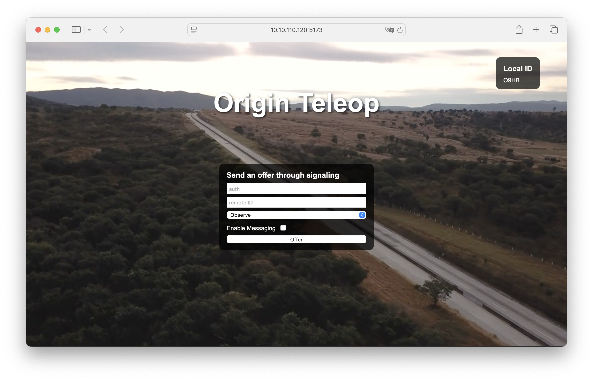

# WebRTC Teleoperation

This project is a WebRTC teleoperation application that allows a user to control a robot remotely using a web browser.

For more information about project structure and components refer to [docs](docs/index.md).

For more information about changes and new features see [CHANGELOG.md](CHANGELOG.md).

## Dependencies

- [nlohmann JSON](https://github.com/nlohmann/json)
- [libdatachannel](https://github.com/paullouisageneau/libdatachannel)
- [FFmpeg](https://ffmpeg.org/)

## Running on the Origin

**Start the signaling server** for establishing the WebRTC connection between the Origin and the web app:

```
$ python signaling/signaling-server.py
```

In separate terminal, in order to **start the web app**, go to the directory where the web app is located:

```
$ cd web_client
```

Install the dependencies with `npm install` if you haven't already.

Start the development server:

```
$ npm run dev -- --host
```

**Starting the teleoperation node.**

On the origin, start the teleoperation container, that will start the teleoperation node automatically:

```
cd ~/webrtc_teleop/docker
docker compose -f docker-compose.yaml up --build
```

If you want to start the development container, where the teleoperation node doesn't start automatically.

Start the teleoperation development container:

```
cd ~/webrtc_teleop/docker
docker compose -f docker-compose.dev.yaml up --build -d
```

Then, you can start the teleoperation node with:

```
ros2 launch origin_webrtc_teleop origin_webrtc_teleop.launch.py
```

## Configuration

---

You can adjust the configuration for the teleoperation by editing
the [origin_webrtc_teleop.yaml](origin_webrtc_teleop/config/origin_webrtc_teleop.yaml) file.
Inside the file, you can adjust the following parameters:

- local_id: The unique string that identifies the robot.
- auth: The authentication string that is used to establish a connection between the web app and the robot.
- hostname: The IP address of the signaling server.
- port: The port of the signaling server.
- stun_server: The STUN server used for NAT traversal.
  Video encoding parameters:
- bit_rate: The target bit rate in bits per second.
- width: The width of the video frame in pixels.
- height: The height of the video frame in pixels.
- framerate: The number of frames per second.
- gop_size: Defines the Group of Pictures (GOP) size, setting the interval between keyframes (I-frames).
- max_b_frames: The maximum number of B-frames between I-frames and P-frames.
- ref: Number of reference frames used for motion prediction.
  Additional encoding parameters can be set, following FFmpeg's H.264 encoder options. Most common options are:
- profile: The H.264 profile to use.
- preset: Determines encoding speed/efficiency trade-offs.
- tune: Adjusts the encoder's settings to improve the quality of the encoded video.
- level: Indicates the H.264 level, defining constraints like resolution and bit rate for compatibility.

## Usage

---

**Using the web app:**

- Enter the authentication and id for the robot. It can be found in
  the [origin_webrtc_teleop.yaml](origin_webrtc_teleop/config/origin_webrtc_teleop.yaml) configuration file or in the
  terminal output when the teleoperation node is started.
- Choose `observe` to view the video stream and telemetry data.
- Choose `control` to view the video stream, telemetry data and control the robot using a gamepad.
- Select `Enable messaging` for the chat feature with other clients connected to this robot.
  

---

**Using the controller:**

- Use the left joystick to control the robot's linear velocity.
- Use the right joystick to control the robot's angular velocity.
- Press `X` to reset the control mode.
- Press `A` to reqeust the control mode and start controlling the robot with your controller.
- Press `B` to go to the previous control mode.
- Press `Y` to take over the control of the robot in case multiple joystick controllers are connected and robot is
  already in the correct control mode.