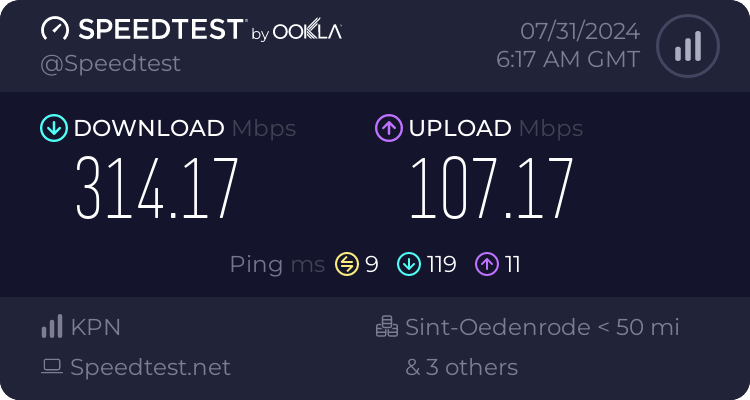
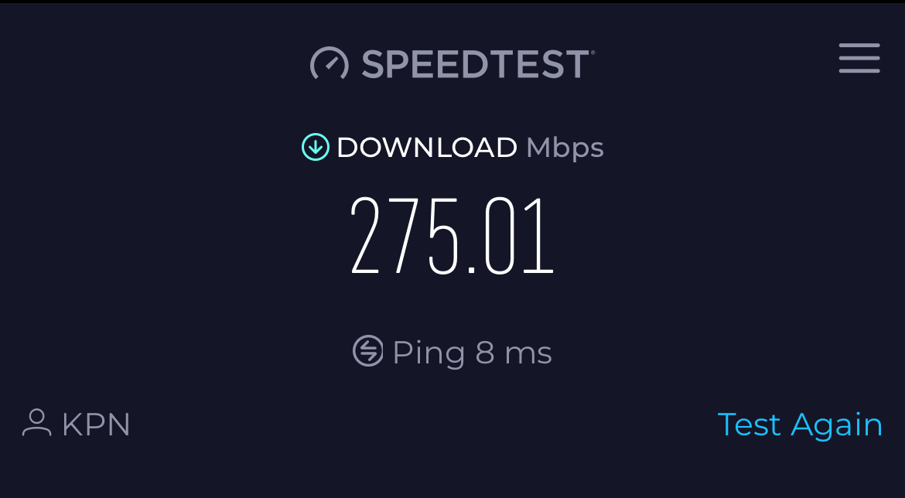

# WebRTC Teleop Latency Test for Robot Control

Test to measure the delay between the video capture and its display on the web app.

## Testing Procedure

The smartphone displayed a running timer with millisecond precision.
The pc's camera captured the timer display.
The WebRTC stream was received and displayed on the receiving device.
15-second test video of both the original timer and the received video stream.
Six screenshots were taken at various points during the test.
Network speeds were measured for both the PC and the smartphone.

## Results

Latency Measurement
Average Latency: Approximately 90ms. The delay remained relatively consistent.

## Network Speeds

### PC network speed: 

### Smartphone network speed: 

## Implications for Robot Control

A 90ms latency in the video feed allows for:

- Near real-time visual feedback
- Responsive robot control in most scenarios
- Effective teleoperation for tasks that don't require split-second timing

## Future Work

- Extended duration tests
- Various network condition testing
- Tests with video stram from Origin
- Integrated latency monitoring