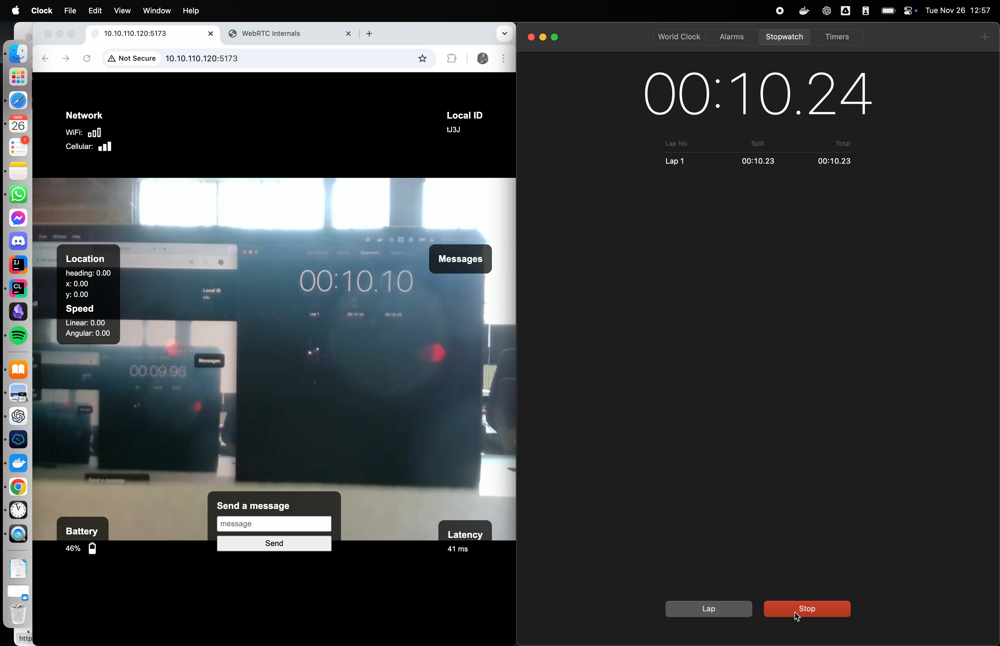

# WebRTC Teleop Latency Test for Robot Control

This document contains multiple tests aimed at measuring video latency under different configurations.

---

# Test 1

**Description**

Test to measure the delay between the video capture and its display on the web app of the USB camera without the ROS
network.

**Testing Procedure**

1. The smartphone displayed a running timer with millisecond precision.
2. The pc's camera captured the timer display.
3. The WebRTC stream was received and displayed on the receiving device.
4. 15-second test video of both the original timer and the received video stream.
5. Five screenshots were taken at various points during the test.
6. Network speeds were measured for both the PC and the smartphone.

**Results**

**Latency Measurement**

Average Latency: Approximately 90ms. The delay remained relatively consistent.

---

# Test 2

Test to measure the delay between the video capture and its display on the web app using the camera on the robot with
the ROS network.

**Testing Procedure**

1. The PC displayed a running timer with millisecond precision.
2. The robot's camera captured the timer display.
3. The WebRTC stream was received and displayed on the PC.
4. 15-second test video of both the original timer and the received video stream.
5. Five screenshots were taken at various points during the test.

**Results**

**Latency Measurement**

Average Latency: Approximately 150ms. The delay remained relatively consistent.

---

# Test 3

Test between different configurations of the video stream.

| resolution | framerate | bitrate | GOP size | refs | latency | actual framerate | actual latency |
|------------|-----------|---------|----------|------|---------|------------------|----------------|
| 640x480    | 30        | 2000000 | 15       | 2    | 40-60ms | ~30              | 100-150ms      |
| 640x480    | 30        | 2000000 | 15       | 0    | 50-90ms | ~30              | 120-170ms      |
| 640x480    | 30        | 2000000 | 30       | 0    | 50-80ms | ~30              | 120-160ms      |
| 640x480    | 30        | 500000  | 30       | 3    | 40-50ms | ~30              | 100-150ms      |
| 640x480    | 30        | 1000000 | 30       | 3    | 35-50ms | ~30              | 90-140ms       |
| 640x480    | 30        | 2000000 | 30       | 3    | 35-50ms | ~30              | 80-140ms       |
| 640x480    | 30        | 3000000 | 30       | 3    | 40-60ms | ~30              | 100-150ms      |

Key variables included bitrate, GOP size, and reference frames (refs). After evaluating latency and actual frame rates,
we selected a configuration with a GOP size of 30, bitrate of 2,000,000, and 3 reference frames, which minimalizes the
latency.

---

# Implications for Robot Control based and all tests

A 150ms latency in the video feed allows for:

- Near real-time visual feedback
- Responsive robot control in most scenarios
- Effective teleoperation for tasks that don't require split-second timing

---

## Future Work

- Extended duration tests
- Various network condition testing
- Test with different client devices
- Additional camera configurations
- Integrated latency monitoring
